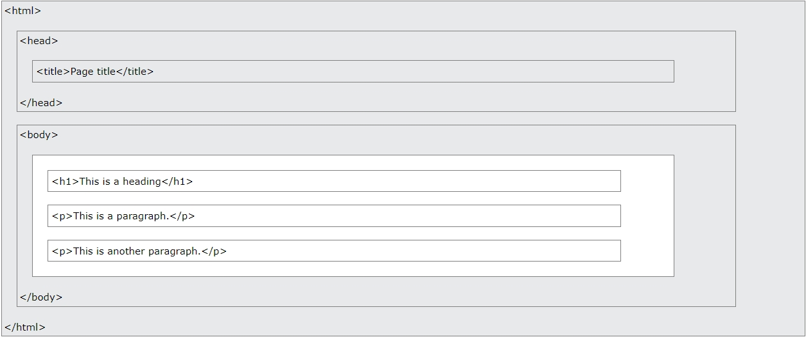

# HTML course 🎉

## learning resources

-   [Elzero html](https://elzero.org/study/html-2021-study-plan/)
-   [W3schools](https://www.w3schools.com/html)
-   [FreeCodeCamp HTML Course](https://www.freecodecamp.org/learn/2022/responsive-web-design)
-   [Mozilla Developer Network (MDN) Web Docs](https://developer.mozilla.org/en-US/docs/Web/HTML)
-   [HTML living standard (advanced)](https://html.spec.whatwg.org/multipage/dom.html#the-title-attribute)

## What is HTML?

-   html stands for Hyper Text Markup Language
-   describes the structure of a Web page
-   html elements tell the browser how to display the content

```html
<!DOCTYPE html>
<html>
    <head>
        <title>My page title</title>
    </head>
    <body>
        <h1>My First Heading</h1>
        <p>My first paragraph.</p>
    </body>
</html>
```

## What is an HTML Element?

<tag> Hi there✋ </tag>

### Types of elements

-   normal tag like `h1`
-   Self-closed tag like `br`

## HTML Page Structure



## HTML History

| Year | Version                                 |
| ---- | --------------------------------------- |
| 1991 | Tim Berners-Lee invented HTML           |
| 1995 | HTML Working Group defined HTML 2.0     |
| 1997 | W3C Recommendation: HTML 3.2            |
| 1999 | W3C Recommendation: HTML 4.01           |
| 2000 | W3C Recommendation: XHTML 1.0           |
| 2008 | WHATWG HTML5 First Public Draft         |
| 2012 | WHATWG HTML5 Living Standard            |
| 2014 | W3C Recommendation: HTML5               |
| 2016 | W3C Candidate Recommendation: HTML 5.1  |
| 2017 | W3C Recommendation: HTML5.1 2nd Edition |
| 2017 | W3C Recommendation: HTML5.2             |

`audio and video tags only supported in html 5` before html 5 we need to use flash.

**examples of html doctype in different versions**

-   strict HTML 4.01 `<!DOCTYPE HTML PUBLIC "-//W3C//DTD HTML 4.01//EN" "http://www.w3.org/TR/html4/strict.dtd">`
-   transitional HTML 4.01 `<!DOCTYPE HTML PUBLIC "-//W3C//DTD HTML 4.01 Transitional//EN" "http://www.w3.org/TR/html4/loose.dtd">`
-   frameset HTML 4.01 `<!DOCTYPE HTML PUBLIC "-//W3C//DTD HTML 4.01 Frameset//EN" "http://www.w3.org/TR/html4/frameset.dtd">`
-   HTML5 `<!DOCTYPE html>`

---

## html comments

```
<!-- here is my comment 🚀 -->
```

## HTML Headings

HTML headings are defined with the `<h1>` to `<h6>` tags.

-   `<h1>` for the most important heading.
-   `<h6>` for the least important heading
-   only use one `h1` tag in the page

```html
<h1>This is heading 1</h1>
<h2>This is heading 2</h2>
<h3>This is heading 3</h3>
```

## HTML Paragraphs

```html
<p>This is a paragraph.</p>
```

## Links

```html
<a href="https://www.google.com">This is a link</a>

<!-- target Attribute -->
    <!-- default -->
    <a href="https://www.google.com/" target="_self ">Visit google!</a>

    <!--  Opens the document in a new window or tab -->
    <a href="https://www.google.com/" target="_blank">Visit google!</a>
```

**types of URL in html attributes**

-   absolute URL `hosted on another server`
-   relative URL `hosted within the server`


## Images

```html

```


## html attributes

> HTML attributes provide additional information about HTML elements.

-   All HTML elements can have attributes
-   Attributes provide additional information about elements
-   Attributes are always specified in the start tag
-   Attributes usually come in name/value pairs like: name="value"

```html
<!-- The lang Attribute -->
<html lang="en">

<!-- style attribute -->
<p style="color:red;">This is a red paragraph.</p>
```

## HTML horizontal line and line breaks

```html
<!-- horizontal line -->
<p>This is some text.</p>
<hr>
<h2>This is heading 2</h2>

<!-- line breaks -->
<p>This is <br>a paragraph<br> with line breaks.</p>
```

## `<pre>` (preformatted text element)

```html
<pre>
  Twinkle, twinkle, little star,
  Like a diamond in the sky.

  When the sun is gone,
  Show your light,
  Twinkle all night.

  In the dark sky,
  Never shut your eye,
  Twinkle, little star.
</pre>
```


## html id and class attributes
create a bookmark in html using the id
```html
<h3 id="section-1">section one here</h3>
<a href="#section-1">to section one</a>

<!-- add a link to a bookmark on another page -->
<a href="page2.html#section-10">Jump to Chapter 4</a>
```


## html head

```html
<head>

    <!-- Define the character set used: -->
    <meta charset="UTF-8">

    <!-- Define keywords for search engines -->
    <meta name="keywords" content="HTML, CSS, JavaScript">

    <!-- Define a description of your web page: -->
    <meta name="description" content="Free Web tutorials">

    <!-- Setting the viewport to make your website look good on all devices: -->
    <meta name="viewport" content="width=device-width, initial-scale=1.0">


    <title>Page Title</title>
    <style>
        body {background-color: red;}
    </style>
</head>
```

## HTML Favicon

```html
<head>
<link rel="icon" type="image/x-icon" href="/images/logo.svg">
</head>
```


## html table

```html

<style>
table, th, td {
  border:1px solid black;
  border-collapse: collapse;
}
</style>


<table style="width:100%">
  <caption>Languages</caption>
  <tr>
    <th style="width:50%" colspan="1" rowspan="2">Language</th>
    <th>Designed By</th>
    <th>First Appeared</th>
  </tr>
  <tr>
    <td>Python</td>
    <td>Guido van Rossum</td>
    <td>1991</td>
  </tr>
  <tr style="height:100px">
    <td>JavaScript</td>
    <td>Brendan Eich</td>
    <td>1995</td>
  </tr>
  <tr>
    <td>C++</td>
    <td>Bjarne Stroustrup</td>
    <td>1983</td>
  </tr>
</table>
```

## HTML Lists
**Unordered HTML List**
```html
<ul>
  <li>Coffee</li>
  <li>Tea</li>
  <li>Milk</li>
</ul>
```

**Ordered HTML List**
```html
<ol type="1" start="10"> 
  <li>Coffee</li>
  <li>Tea</li>
  <li>Milk</li>
</ol>

<!-- By default, an ordered list will start counting from 1. If you want to start counting from a specified number, you can use the start attribute: -->
<!-- ol type ==> (1 - A - a - I - i) -->
```

**Nested HTML Lists**
```html
<ol>
  <li>Coffee</li>
  <li>Tea
    <ol>
      <li>Black tea</li>
      <li>Green tea</li>
    </ol>
  </li>
  <li>Milk</li>
</ol>
```

## inline and block element 
```html
<!-- block -->
<p>Hello World</p>
<div>Hello World</div>

<!-- inline -->
<span>Hello World</span>

```

- The `<div>` element is a block-level and is often used as a container for other HTML elements
- The `<span>` element is an inline container used to mark up a part of a text, or a part of a document


## HTML Layout Elements
- `<header>`
- `<nav>`
- `<section>`
- `<aside>`
- `<footer>`
- `<details>` and `<summary>`

```html
<details>
  <summary>JavaScript</summary>
  <p>JavaScript is a popular programming language used for front-end and back-end web development. It provides interactivity and dynamic functionality to websites, making them more engaging for users. JavaScript can be used to create interactive forms, handle events, manipulate HTML elements, make API calls, and build powerful web applications.</p>
</details>
```

## HTML Formatting Elements

-   `<b>` - Bold text
-   `<i>` - Italic text
-   `<mark>` - Marked text
-   `<small>` - Smaller text
-   `<del>` - Deleted text
-   `<ins>` - Inserted text
-   `<sub>` - Subscript text
-   `<sup>` - Superscript text
-   `<abbr>` - defines an abbreviation
-   `<address>` , `<cite>`
-   `<bdo>` for Bi-Directional Override

## HTML `<blockquote>` and `<q>` for Quotations

-   `<blockquote>` long quotation.
-   `<q>` short quotation.

```html
<blockquote cite="http://www.worldwildlife.org/who/index.html">
  Nature is our greatest teacher. It has thrived for millions of years, adapting, evolving, and finding balance. As stewards of this planet, it is our responsibility to learn from nature and protect its delicate ecosystems.
</blockquote>

<q>One person can make a difference, and everyone should try.</q>


```


## Html forms
```html
<!-- text -->
<form>
  <label for="fname">First name:</label><br>
  <input type="text" id="fname" name="fname"><br>
  <label for="lname">Last name:</label><br>
  <input type="text" id="lname" name="lname">
  <button type="submit">Login</button>
</form>


<!-- radio -->
<form>
  <input type="radio" id="html" name="fav_language" value="HTML">
  <label for="html">HTML</label><br>
  <input type="radio" id="css" name="fav_language" value="CSS">
  <label for="css">CSS</label><br>
  <input type="radio" id="javascript" name="fav_language" value="JavaScript">
  <label for="javascript">JavaScript</label>
</form>

<!-- checkboxes -->
<form>
  <input type="checkbox" id="vehicle1" name="vehicle1" value="Bike">
  <label for="vehicle1"> I have a bike</label><br>
  <input type="checkbox" id="vehicle2" name="vehicle2" value="Car">
  <label for="vehicle2"> I have a car</label><br>
  <input type="checkbox" id="vehicle3" name="vehicle3" value="Boat">
  <label for="vehicle3"> I have a boat</label>
</form>

<!-- select -->
<label for="cars">Choose a car:</label>
<select id="cars" name="cars" multiple>
  <option value="volvo" selected>Volvo</option>
  <option value="saab">Saab</option>
  <option value="fiat">Fiat</option>
  <option value="audi">Audi</option>
</select>

<!-- textarea -->
<textarea name="message" rows="10" cols="30">
your message here....
</textarea>

<!-- fieldset -->
<fieldset>
    <legend>Personalia:</legend>
    <label for="fname">First name:</label><br>
    <input type="text" id="fname" name="fname" value="John"><br>
    <label for="lname">Last name:</label><br>
    <input type="text" id="lname" name="lname" value="Doe"><br><br>
    <input type="submit" value="Submit">
</fieldset>

<!-- search with datalist -->
<input list="browsers">
<datalist id="browsers">
    <option value="Internet Explorer">
    <option value="Firefox">
    <option value="Chrome">
    <option value="Opera">
    <option value="Safari">
</datalist>


<!-- Attributes -->
<form action="/login.php" target="_self" method="get" autocomplete="on" novalidate >
  <label for="fname" required>First name:</label><br>
  <input type="text" id="fname" name="fname"><br>
  <label for="lname">Last name:</label><br>
  <input type="text" id="lname" name="lname">

  <label for="datemin">Enter a date after 2000-01-01:</label>
  <input type="date" id="datemin" name="datemin" min="2000-01-02"><br><br>

  <!-- defines an image as a submit button. -->
  <input type="image" src="submit.png" alt="Submit" width="48" height="48">

  <button type="button" onclick="alert('successfully login to the system')">Login</button>
</form>


```

HTML input types 
- `<input type="button">`
- `<input type="checkbox">`
- `<input type="color">`
- `<input type="date">`
- `<input type="datetime-local`">
- `<input type="email">`
- `<input type="file">`
- `<input type="hidden">`
- `<input type="image">`
- `<input type="month">`
- `<input type="number">`
- `<input type="password">`
- `<input type="radio">`
- `<input type="range">`
- `<input type="reset">`
- `<input type="search">`
- `<input type="submit">`
- `<input type="tel">`
- `<input type="text">`
- `<input type="time">`
- `<input type="url">`
- `<input type="week">`

html input attributes
- `value`
- `readonly`
- `disabled`
- `required`
- `step`
- `autofocus`
- `autocomplete`

## html style Guide

-   Never Skip the End Tag
-   HTML is Not Case Sensitive but the recommended way is the lowercase
-   Always Quote Attribute Values
